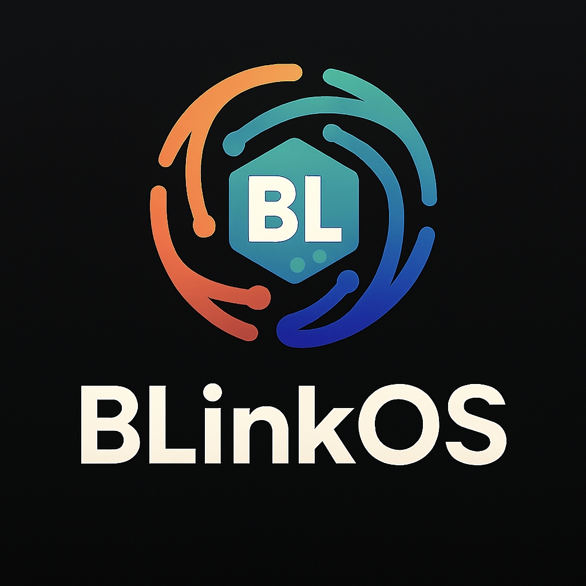

<p align="center">
  <picture>
    <source media="(prefers-color-scheme: dark)" srcset="public/logo-white.jpg">
    
  </picture>
</p>

<h1 align="center">Wiki AI Generator</h1>

<p align="center">
  <strong>Next.js + Tailwind v4 + Shadcn UI wiki with AI image generator.</strong><br>
  Create stickers, icons, emojis via DALL-E. Features markdown editor, kanban, calendar, table, chat views. Craft-style grid, dark/light theme, blur cards. Copy markdown images instantly. Deploy on Vercel.
</p>

<p align="center">
  <strong>Next.js + Tailwind + Shadcn UI + DALL·E</strong><br>
  สร้างภาพ AI ได้ทันที — Sticker, Icon, Emoji
</p>

<p align="center">
  <a href="https://bl1nk-wiki-generate.vercel.app">Live Demo</a> • 
  <a href="#features">Features</a> • 
  <a href="#tech-stack">Tech Stack</a> • 
  <a href="#quick-start">Quick Start</a>
</p>

---

## Features

- Generate stickers, icons, emojis with custom prompts
- Real-time image preview (4 per generation)
- Copy markdown embed with one click
- Craft-style responsive grid layout
- Dark/light theme with blur glass cards
- Integrated views: markdown editor, kanban, calendar, table, chat
- Deploy instantly on Vercel

---

## Tech Stack

- Next.js 14 (App Router)
- Tailwind CSS v4
- Shadcn UI components
- OpenAI DALL-E 3 API
- TypeScript
- React Query
- Vercel

---

## Quick Start

```bash
git clone https://github.com/billlzzz18/bl1nk-wiki-generate.git
cd bl1nk-wiki-generate
npm install
cp .env.example .env.local
# Add OPENAI_API_KEY
npm run dev
```

> Visit [**`/generator`**](https://bl1nk-wiki-generate.vercel.app/generator) to create AI images

---

### Deploy with one click

<p align="center">
  <a href="https://vercel.com/new/clone?repository-url=https://github.com/billlzzz18/bl1nk-wiki-generate">
    
  </a>
</p>

---

<p align="center">Perfect for personal wikis, documentation, or creative tools</p>

---

## License

[MIT License](LICENSE) – free to use, modify, and distribute.

## Code of Conduct

We follow the [Contributor Covenant](CODE_OF_CONDUCT.md) – be respectful, inclusive, and kind.

---

<p align="centerMade with by <a href="https://github.com/billlzzz18">billlzzz18</a>dark
